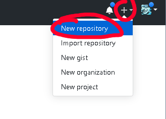

# Github
Github is a service that serves online git repositories.  
Git is the source control application.  
Github is the name of the service.  
They are actually separate things, and there are other services that also serve git repositories, such as BitBucket and gitgud.

Before you can do any of these things on pretty much any service, you would need to create an account.

## Creating a repository
Creating a repository is the first in a project.
There is a fairly large '+' next to  your user icon:  

Clicking this will take you to a page to create a new repository.  

## Forking a repository
If you want to create changes to someone's code, and get your changes added back, the common way is to:
- fork their repository
- push your changes to the fork
- and pull request the changes back to the original

Any public repository can be forked, giving you a copy.  
Think of the shape of the fork. The name makes perfect sense.

To fork a repository, go to the repository's home page, such as:
https://github.com/project64/project64
Then click the fork button:

## Creating a pull request
